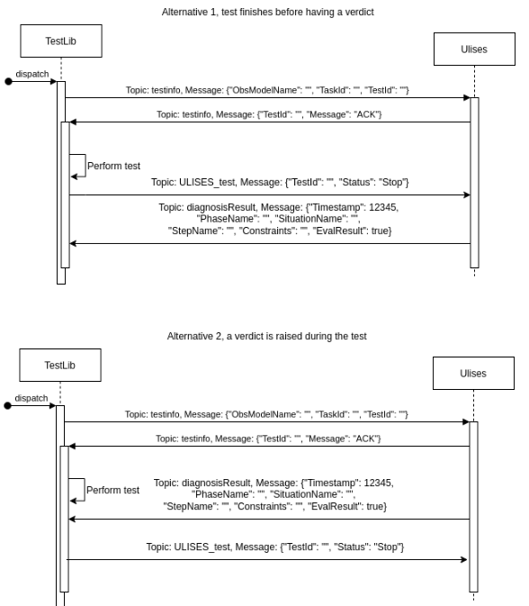

# Ulises Test Utils

A ROS Python module to synchronize ros tests executions with external V&V tool (ej.: ULISES) via ROS-MQTT bridge.

The aim of this project is to communicate test runs in ROS with the ULISES diagnostic tool. The communication protocol/system is can be used with ULISES but in the future it could be used to communicate other validation tools with ROS test runs.


ULISES currently receives positioning (tf) data via ROS-MQTT bridge. The idea is that ULISES not only receives data to be analysed but also messages indicating which test is to be performed, and that the test has started. In turn, ULISES will indicate to the ROS test whether the system has behaved correctly or not. This information could be used as ASSERT in the tests.

The basic functionalities are:

1. TEST_START message
2. TEST_STATUS / ASSERT message
3. TEST END message
4. TEST ERROR message

In the following image, you can see the sequence diagram of the synchronization between ULISES and the tests in ROS through the Ulises Test Utils. In two situations when the test finishes correctly or when it is interrupted by an error.




## Python Test Integration

To coordinate with ULISES, the UlisesTestHelper handles the synchronization protocol. At the beginning of a test, the developer instantiates a TestLaunchInfo object, which specifies the observation model (XML), task identifier, and test identifier. The helper then establishes an MQTT session with ULISES, sends a TEST_START message, and waits for diagnostic feedback. During the test execution, the SUT is commanded through ROS interfaces (e.g., activating pistons, conveyors, robot motions, and fridge doors). Once the test sequence finishes, the helper waits for an assertion from ULISES (ASSERT or TEST_ERROR). This diagnostic result is used directly as an assert in the Python test, ensuring that verification is automated and tightly integrated with the simulation.
Each test is implemented with unittest and synchronized with ULISES through the UlisesTestHelper API:

```python
from ulises_test_utils.test_utils import (
    TestLaunchInfo, UlisesTestHelper
)

class FridgeDisassemblyTest(unittest.TestCase):
    def test_fridge_disassembly(self):
        # Define test metadata
        test_info = TestLaunchInfo(
            observation_model_name='FridgeDisassemblyOM.xml',
            task_id='3ef9c5db-630d-4537-b30c-95831447aeb6',
            test_id='1'
        )

        # Synchronize with ULISES
        with UlisesTestHelper(mqtt_host="172.17.6.163", test_launch_info=test_info) as helper:
            # Interact with the SUT
            task.control_piston("pistons_01", True)
            task.control_conveyor("conveyor_00", True)
            task.control_fridge_doors("fridge_00", ["up", "down"], True)
            # ... more interactions ...with the SUT/SIMULATION ENVIROMENT
            # Wait for diagnostic assertion from ULISES
            helper.wait_assert_passed()
```
